<h1 align="center">Shovelbox</h1>
<p align="center">
  <b>.NET Systems Engineer</b><br/>
  <code>desktop · platforms · large-scale event systems</code>
</p>

<p align="center">
  
  
  
  
</p>

<br/>

```
Shipping core systems for venues that can't go down on game day.
```

<br/>

<table align="center">
  <tr>
    <td><b>Now</b></td>
    <td>Core system development for the <b>2026 Aichi-Nagoya Asian Games</b></td>
  </tr>
  <tr>
    <td><b>Stack</b></td>
    <td>C# · .NET · WPF · WinUI 3 · gRPC</td>
  </tr>
  <tr>
    <td><b>Domain</b></td>
    <td>Event platforms · operator clients · service pipelines · reliability</td>
  </tr>
</table>

<br/>

<p align="center">
  
</p>

<br/>

### What I build

- **Event core systems** — match/operation flows that stay up under peak load
- **Desktop clients** — WPF / WinUI 3 tools for operators and staff
- **Service layer** — gRPC/.NET backends connecting venues, clients, and data

<br/>

---

<p align="center">
  
</p>
