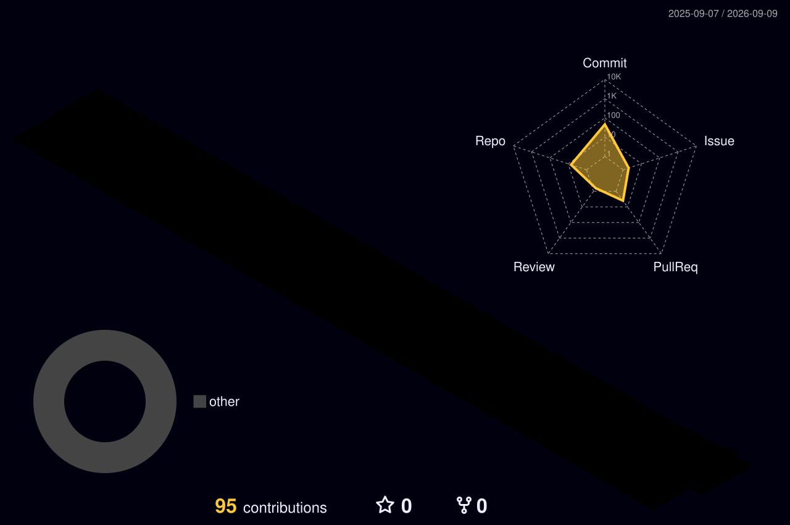

<h1 align="center">Shovelbox</h1>
<p align="center"><code>.NET · desktop & systems</code></p>
<br>

```
I build desktop experiences and the systems behind them.
```

<br>

<table align="center">
<tr><td><b>Stack</b></td><td>C# · .NET · WPF · WinUI 3</td></tr>
<tr><td><b>Domain</b></td><td>Desktop applications · gRPC systems · Core platform development</td></tr>
</table>

<br>

### Selected Works

[**Log-in**](https://github.com/shovelbox/Log-in) — WinUI 3 login animation experiment. Focused on fluid motion and Fluent-style interaction.

[**gRPC**](https://github.com/shovelbox/gRPC) — gRPC service/client exploration in .NET for structured, high-performance RPC.

[**winUI3**](https://github.com/shovelbox/winUI3) — WinUI 3 playground for modern Windows desktop UI patterns.

<br>

<p align="center">
Currently working on: Core system development for the 2026 Aichi-Nagoya Asian Games.
</p>

<br>

---

<a href="./profile-3d-contrib/profile-night-rainbow.svg">
  
</a>

---

<p align="center">
  <a href="https://github.com/shovelbox?tab=repositories">
    
  </a>
  <a href="https://github.com/shovelbox?tab=overview&from=2026-01-01">
    
  </a>
</p>
